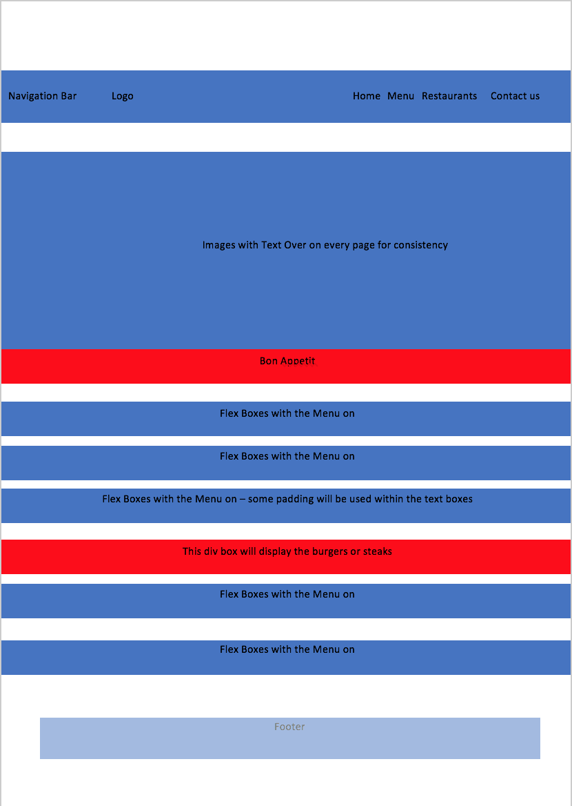

# Monmos Grill
- Sketches For Website

- Struggled with the code on the SVG animation couldn't get it to move
therefore used Margin-top: xxx
- Wasn't able to remove the errors from the javascript for the google Maps API.
- I have got errors within the CSS which I simply cannot remove, have researched the
issue and a lot of posts on treehouse community say that the code has not been implemented within
the validator.

-Used the following to beautify and validate the HTML and CSS and Javascript

- Ran the CSS through the beautifier and copied and pasted the code within.

#References
- https://jigsaw.w3.org/css-validator/#validate_by_upload
- https://codebeautify.org/
- https://codepen.io/denkoch/pen/qdPKJz
- https://codepen.io/
- https://teamtreehouse.com/community
- https://css-tricks.com/
- Duckett, J. (2017). HTML & CSS. pp.28 - 204.
- Duckett, J. (2017). JavaScript & JQuery. pp.137 - 157.
